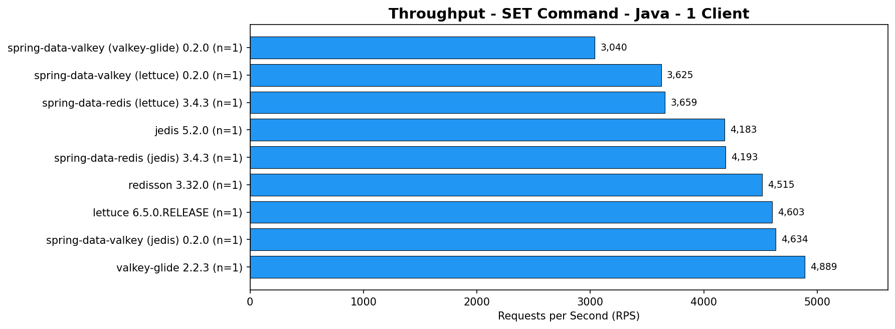
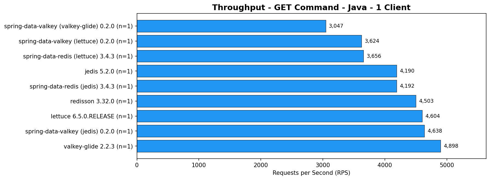
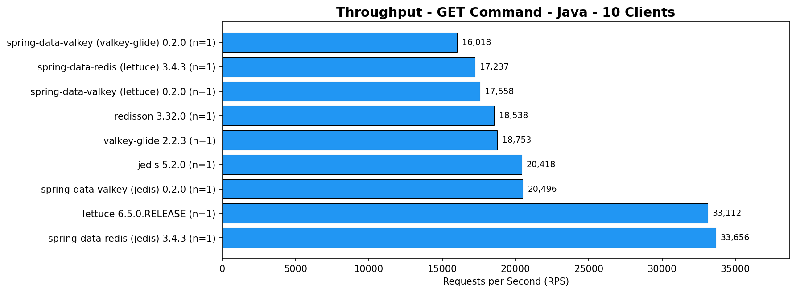
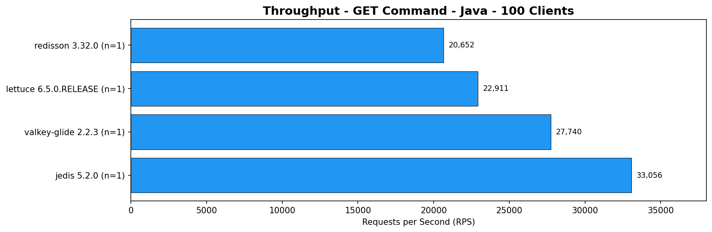
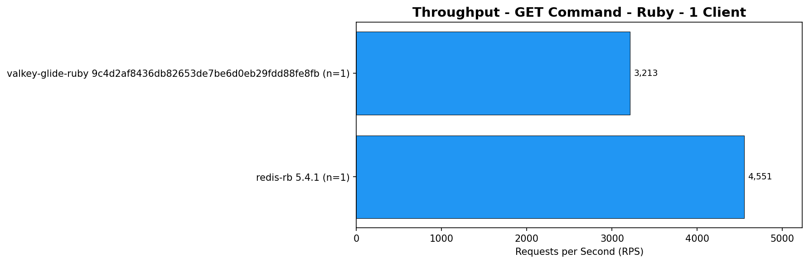

# resp-bench

A multi-language benchmark suite for RESP protocol (Redis/Valkey) compatible databases and client libraries.

## Performance Comparison

The graphs below show throughput (RPS) comparisons across client libraries, separated by language. Results are automatically updated via CI on GitHub Actions runners.

### Java Clients

#### Single Client (1 connection)




#### 10 Concurrent Clients




#### 100 Concurrent Clients




> 📊 [Full Java latency breakdown (p50, p95, p99, p999)](docs/BENCHMARKS_JAVA.md)

### Ruby Clients

#### Single Client (1 connection)




#### 10 Concurrent Clients


#### 100 Concurrent Clients


> 📊 [Full Ruby latency breakdown (p50, p95, p99, p999)](docs/BENCHMARKS_RUBY.md)

> **Note**: These benchmarks run on shared GitHub Actions runners. Results may have variance between runs due to noisy neighbor effects. The graphs show averages across multiple runs (n=count shown in labels).

## Overview

**resp-bench** provides unified benchmark functionality across multiple programming languages, enabling fair comparisons between different client libraries and implementations. All language engines share the same:

- **Configuration format** - JSON-based driver and workload configurations
- **Traffic generation algorithms** - Consistent key generation, rate limiting, and workload patterns
- **Metrics output** - NDJSON with HdrHistogram for cross-language analysis

## Supported Languages

| Language | Status | Supported Drivers |
|----------|--------|-------------------|
| Java | ✅ Ready | Jedis, Lettuce, Valkey-Glide, Redisson, Spring Data Valkey/Redis |
| Ruby | ✅ Ready | redis-rb, valkey-glide-ruby |
| Python | 🚧 Planned | redis-py, aioredis, valkey-glide |
| Go | 📋 Future | go-redis, rueidis |
| Node.js | 📋 Future | ioredis, node-redis |

## Quick Start

### Prerequisites

- Make (for server management)
- Language-specific build tools (Maven for Java, pip for Python, etc.)

### 1. Start a Server

```bash
# Start standalone Valkey/Redis server on port 6379
make server-standalone-start

# Or start a cluster (ports 7379-7382)
make server-cluster-init
```

### 2. Run a Benchmark

**Java:**
```bash
make java-run \
  DRIVER=configs/drivers/example-jedis-standalone.json \
  WORKLOAD=configs/workloads/example-workload.json
```

**Ruby:**
```bash
make ruby-run \
  DRIVER=configs/drivers/example-redis-rb-standalone.json \
  WORKLOAD=configs/workloads/example-workload.json
```

**Python (when available):**
```bash
make python-run \
  DRIVER=configs/drivers/example-redis-py-standalone.json \
  WORKLOAD=configs/workloads/example-workload.json
```

### 3. Stop Servers

```bash
make server-stop
```

## Project Structure

```
resp-bench/
├── README.md                    # This file
├── LICENSE                      # Apache 2.0
├── Makefile                     # Server management + language targets
├── configs/                     # Shared configuration files
│   ├── schemas/                 # JSON schemas for validation
│   ├── drivers/                 # Driver configurations
│   └── workloads/               # Workload definitions
├── config-editor/               # React-based configuration editor UI
├── java/                        # Java benchmark engine
├── ruby/                        # Ruby benchmark engine
├── python/                      # Python benchmark engine (planned)
├── docs/                        # Documentation
│   ├── ARCHITECTURE.md          # System architecture
│   ├── ADDING_LANGUAGE.md       # Guide for adding new languages
│   ├── CONFIG_SPECIFICATION.md  # Configuration format spec
│   ├── BENCHMARKS_JAVA.md       # Full Java benchmark details (all percentiles)
│   └── BENCHMARKS_RUBY.md       # Full Ruby benchmark details (all percentiles)
├── graphs/                      # Auto-generated benchmark graphs
│   ├── java/                    # Java client graphs
│   │   ├── 1-client/            # Single client results
│   │   ├── 10-clients/          # 10 concurrent clients
│   │   └── 100-clients/         # 100 concurrent clients
│   └── ruby/                    # Ruby client graphs
│       ├── 1-client/
│       ├── 10-clients/
│       └── 100-clients/
└── output/                      # Default metrics output directory
```

## Configuration

### Driver Configuration

Defines which client library to use:

```json
{
  "schema_version": "1.0",
  "description": "Jedis client - standalone mode",
  "driver_id": "jedis",
  "mode": "standalone",
  "specific_driver_config": {}
}
```

### Workload Configuration

Defines the benchmark phases and traffic patterns:

```json
{
  "schema_version": "1.0",
  "benchmark_profile": {
    "name": "Example Benchmark",
    "description": "Two-phase benchmark"
  },
  "phases": [
    {
      "id": "WARMUP",
      "connections": 10,
      "completion": {"type": "requests", "requests": 1000},
      "keyspace": {
        "keys_count": 1000,
        "key_prefix": "bench:",
        "generation_alg": "sequential_int"
      },
      "commands": [
        {"command": "set", "weight": 1.0, "data_size_bytes": 256}
      ]
    }
  ]
}
```

See [docs/CONFIG_SPECIFICATION.md](docs/CONFIG_SPECIFICATION.md) for full details.

## Config Editor

A visual tool for creating and editing benchmark configurations without writing JSON manually.

### Starting the Editor

```bash
# Development mode (with hot reload)
make config-editor-dev

# Then open http://localhost:5173 in your browser
```

### Features

- **Driver Configuration**: Select client library, connection mode, and driver-specific settings
- **Workload Configuration**: Define benchmark phases, commands, keyspace settings, and completion criteria
- **Import/Export**: Load existing configs or save new ones as JSON files
- **Live Preview**: See the generated JSON in real-time as you make changes

## Metrics Output

All engines output metrics in NDJSON format (one JSON object per line):

```json
{
  "metadata": {
    "commit_id": "abc123d-dirty",
    "timestamp": "2026-02-15T12:00:00Z",
    "driver_id": "jedis",
    "primary_driver_version": "5.2.0",
    "secondary_driver_id": null,
    "secondary_driver_version": null
  },
  "phase": {
    "id": "STEADY",
    "status": "COMPLETED",
    "duration_ms": 60000
  },
  "totals": {
    "requests": 1000000,
    "errors": 0
  },
  "metrics": {
    "GET": {
      "requests": 800000,
      "latency": {
        "unit": "us",
        "summary": {"p50": 120, "p99": 310, "max": 9000},
        "hdr": {"payload_b64": "H4sIAAAAA..."}
      }
    }
  }
}
```

## Graph Generation

Generate performance comparison graphs from benchmark results:

```bash
# Install Python dependencies
pip install matplotlib numpy

# Generate graphs for Java clients only
python scripts/generate_graphs.py \
  --results results/github-runner/reference/*.ndjson \
  --output graphs/java/1-client/ \
  --phase STEADY \
  --language java \
  --workload "Java - 1 Client"

# Generate graphs for Ruby clients only
python scripts/generate_graphs.py \
  --results results/github-runner/reference/*.ndjson \
  --output graphs/ruby/100-clients/ \
  --phase STEADY \
  --language ruby \
  --workload "Ruby - 100 Clients"

# Generate graphs for a specific commit (all languages)
python scripts/generate_graphs.py \
  --results results/github-runner/reference/*.ndjson \
  --output graphs/ \
  --phase STEADY \
  --commit-id abc123def456
```

### Aggregation Policy

The script aggregates results using a 3-tuple key: `(commit_id, primary_driver_version, secondary_driver_version)`. This ensures only results from the same CI run are compared together.

- **Auto-detection (default)**: When no explicit filter is provided, the script finds the latest record by timestamp and uses its metadata values as the filter
- **Explicit filter**: Use `--commit-id`, `--primary-driver-version`, or `--secondary-driver-version` to filter specific runs

## Make Targets

### Server Management

| Target | Description |
|--------|-------------|
| `make server-start` | Start all servers (standalone + cluster + sentinel) |
| `make server-stop` | Stop all servers |
| `make server-standalone-start` | Start standalone server (port 6379) |
| `make server-cluster-init` | Initialize cluster (ports 7379-7382) |

### Java Engine

| Target | Description |
|--------|-------------|
| `make java-build` | Build Java benchmark JAR |
| `make java-test` | Run unit tests |
| `make java-run` | Run benchmark (uses DRIVER, WORKLOAD, SERVER vars) |
| `make java-info` | Show supported drivers and commands |

### Ruby Engine

| Target | Description |
|--------|-------------|
| `make ruby-build` | Install Ruby dependencies (bundle install) |
| `make ruby-test` | Run unit and integration tests |
| `make ruby-run` | Run benchmark (uses DRIVER, WORKLOAD, SERVER vars) |
| `make ruby-info` | Show supported drivers and commands |

### Config Editor

| Target | Description |
|--------|-------------|
| `make config-editor-dev` | Run config editor in development mode |
| `make config-editor-build` | Build config editor for production |

## Comparing Client Libraries

Example: Compare Jedis vs Lettuce on the same workload:

```bash
# Start server
make server-standalone-start

# Run with Jedis
make java-run \
  DRIVER=configs/drivers/example-jedis-standalone.json \
  WORKLOAD=configs/workloads/example-workload.json \
  METRICS_OUTPUT=output/jedis.ndjson

# Run with Lettuce
make java-run \
  DRIVER=configs/drivers/example-lettuce-standalone.json \
  WORKLOAD=configs/workloads/example-workload.json \
  METRICS_OUTPUT=output/lettuce.ndjson

# Stop server
make server-stop

# Compare results
cat output/jedis.ndjson output/lettuce.ndjson | jq '.phase.id, .metrics.GET.latency.summary'
```

## Contributing

We welcome contributions! See:
- [docs/ARCHITECTURE.md](docs/ARCHITECTURE.md) - Understand the system design
- [docs/ADDING_LANGUAGE.md](docs/ADDING_LANGUAGE.md) - Add support for a new language

## Author

Authored by Ilia Kolominsky

## License

Apache License 2.0 - see [LICENSE](LICENSE)
