# Java Client Benchmarks — Full Details

Detailed performance comparison of Java client libraries running on GitHub Actions runners. Results are automatically updated via CI.

> **Note**: These benchmarks run on shared GitHub Actions runners. Results may have variance between runs due to noisy neighbor effects. The graphs show averages across multiple runs (n=count shown in labels).

## Single Client (1 connection)

### Throughput

### Latency P50

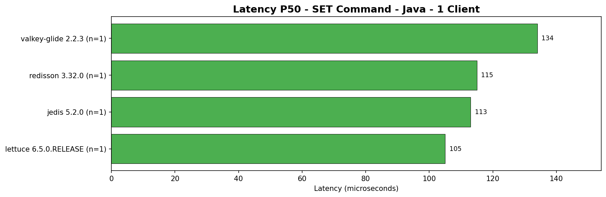
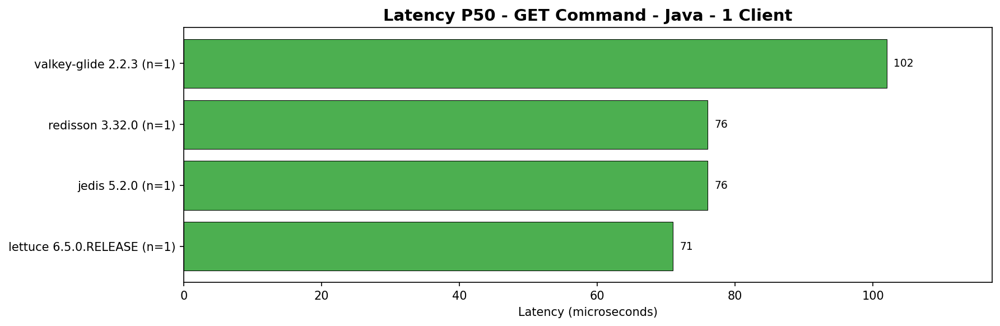

### Latency P95

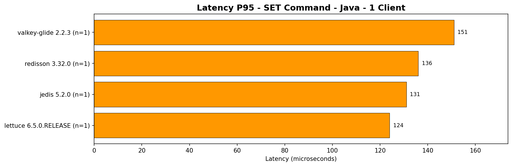
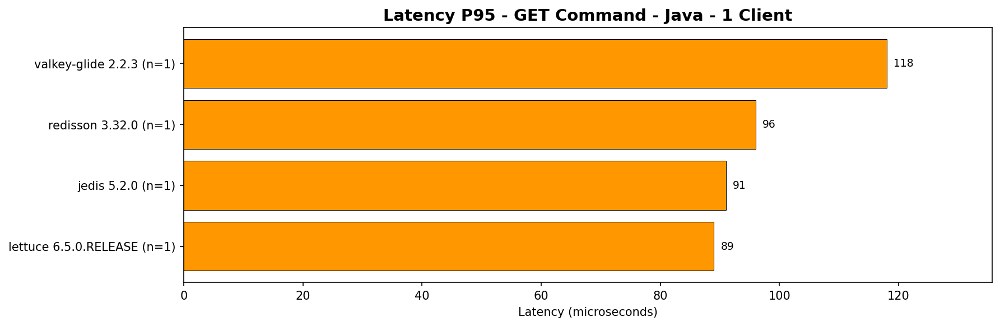

### Latency P99

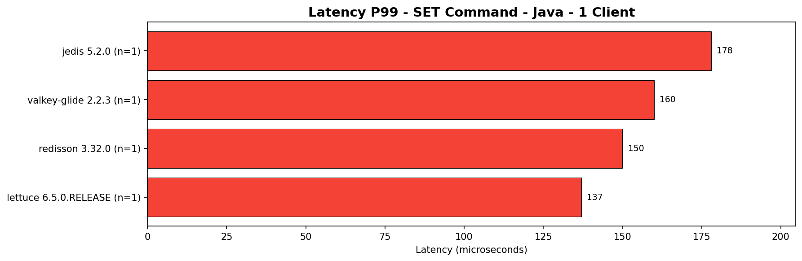
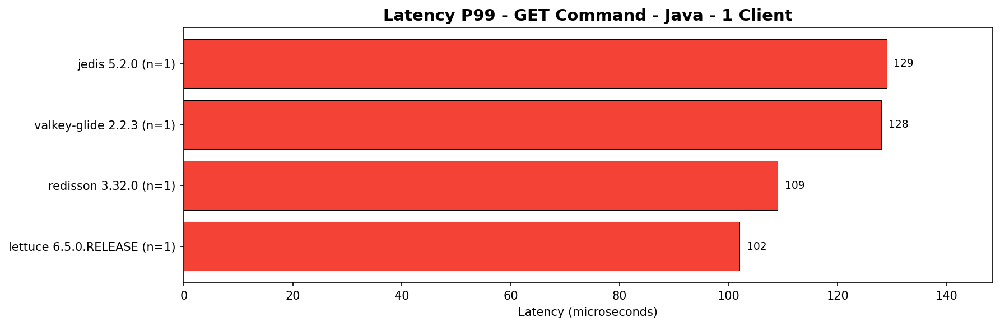

### Latency P999

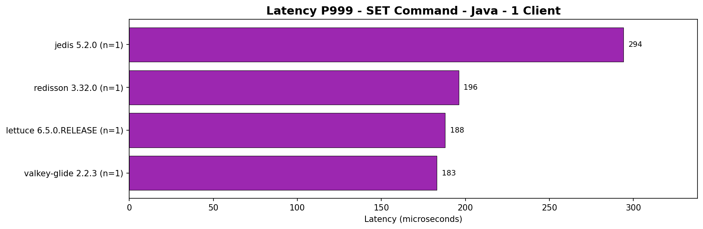
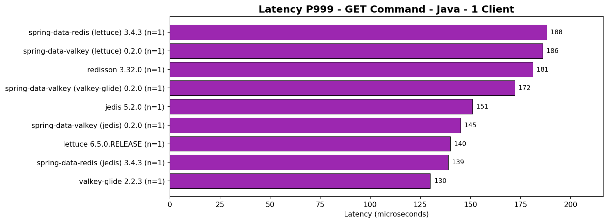

---

## 10 Concurrent Clients

### Throughput

### Latency P50

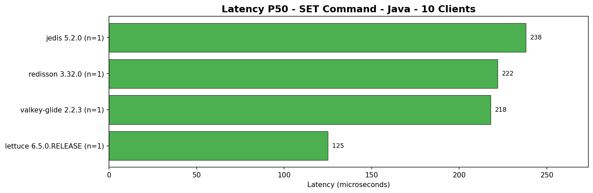
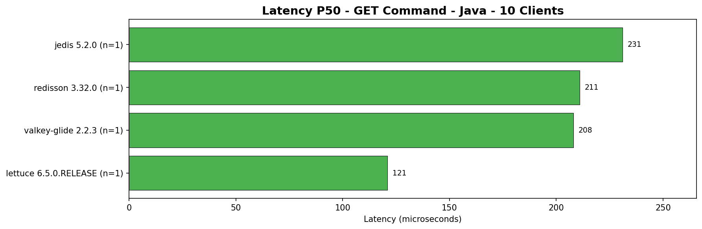

### Latency P95

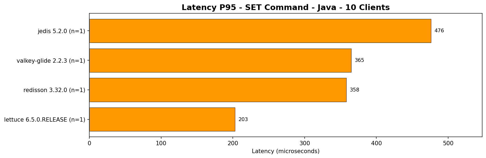
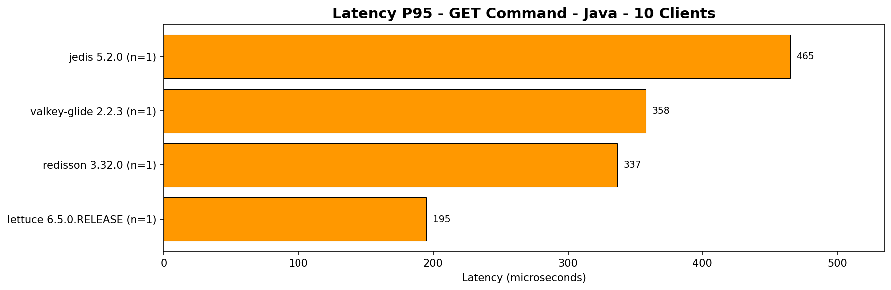

### Latency P99

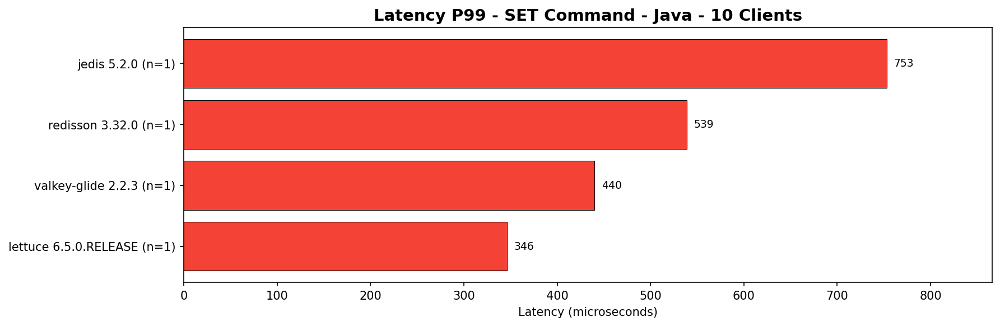
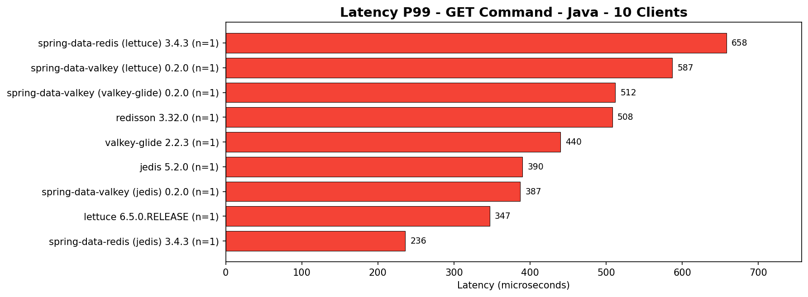

### Latency P999

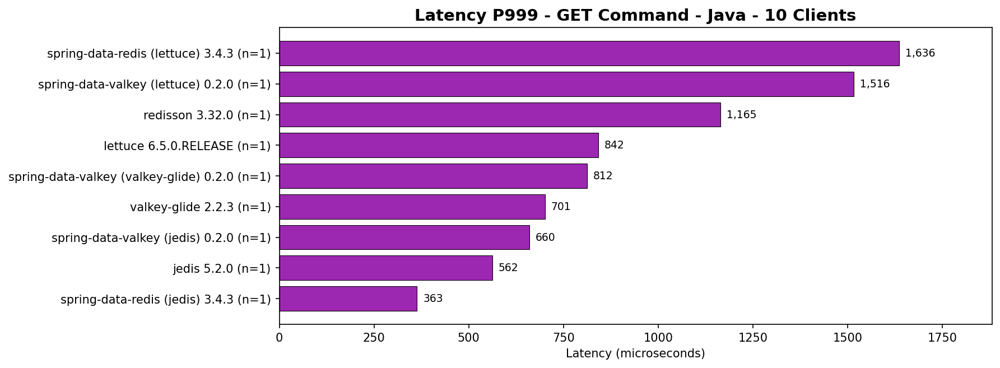

---

## 100 Concurrent Clients

### Throughput

### Latency P50

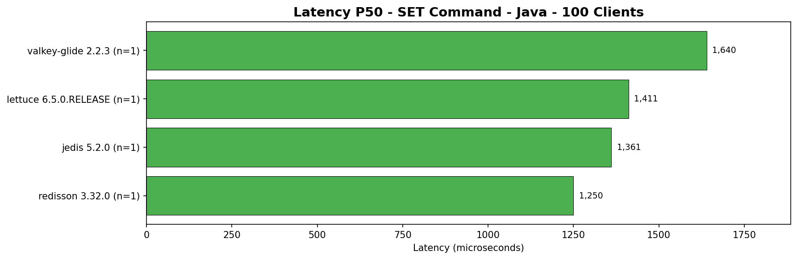
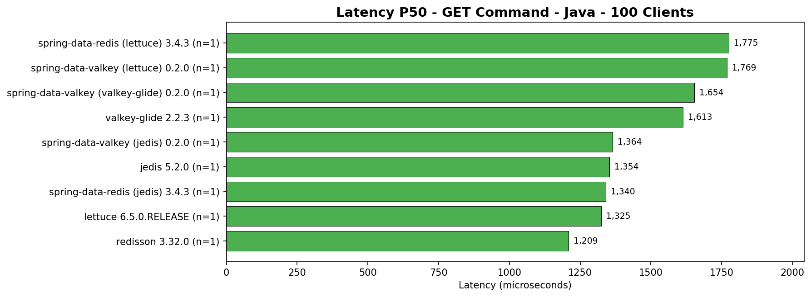

### Latency P95

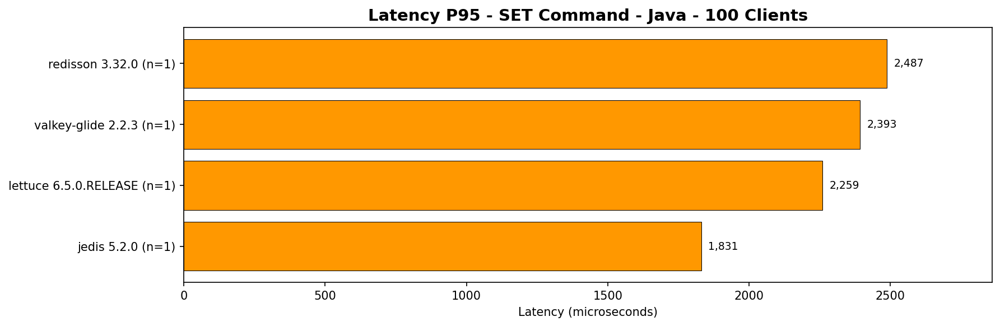
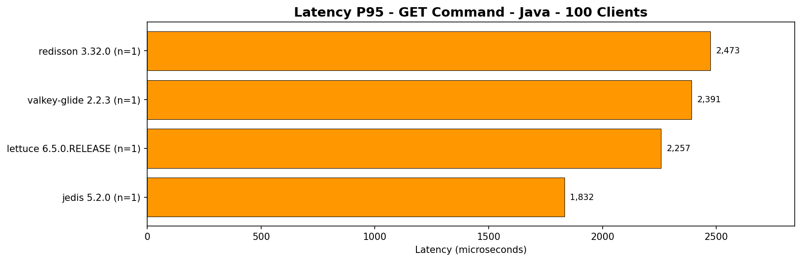

### Latency P99

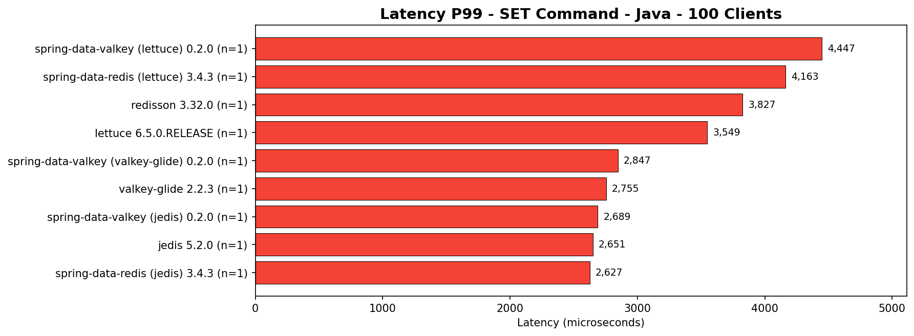
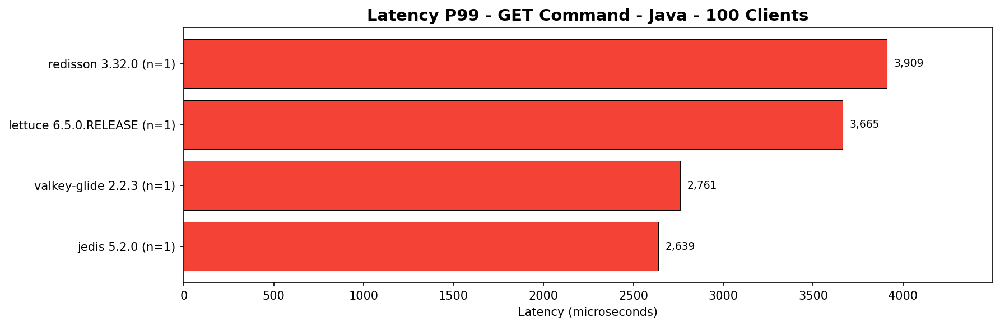

### Latency P999

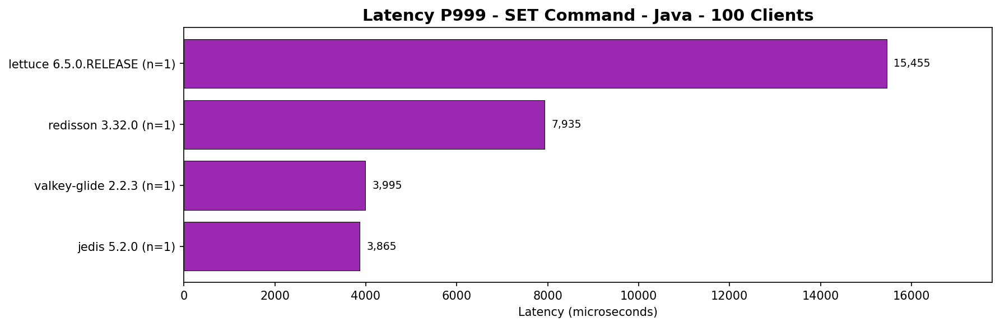
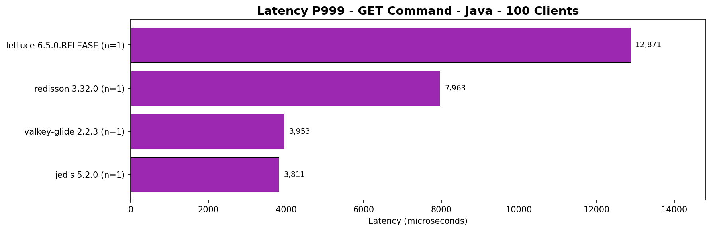

---

## Drivers Tested

| Driver | Description |
|--------|-------------|
| Jedis | Synchronous Java Redis client |
| Lettuce | Asynchronous/reactive Java Redis client |
| Redisson | Feature-rich Redis Java client |
| Valkey-Glide | Valkey's official Java client |
| Spring Data Valkey (Glide) | Spring Data abstraction over Valkey-Glide |
| Spring Data Valkey (Jedis) | Spring Data abstraction over Jedis |
| Spring Data Valkey (Lettuce) | Spring Data abstraction over Lettuce |
| Spring Data Redis (Jedis) | Spring Data Redis abstraction over Jedis |
| Spring Data Redis (Lettuce) | Spring Data Redis abstraction over Lettuce |

## Workload Configuration

All benchmarks use the same reference workload:
- **1M requests** per phase (STEADY)
- **1M keys** with 16-byte keys, `bench:` prefix
- **512 bytes** data size for SET operations
- **50/50 GET/SET** command mix (uniform random)
- **No rate limiting** (max throughput)
